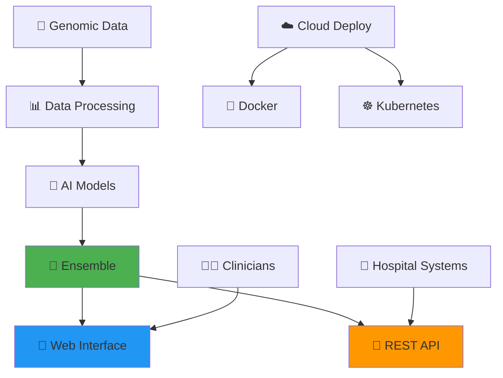

<div align="center">

# 🧬 Cancer Alpha
### Next-Generation AI for Precision Oncology

*Revolutionizing cancer classification through state-of-the-art multi-modal transformer architectures*


[](LICENSE)
[](PATENTS.md)
[](https://www.python.org/downloads/release/python-380/)
[](https://fastapi.tiangolo.com/)
[](https://reactjs.org/)
[](https://www.docker.com/)
[](https://kubernetes.io/)
[](https://github.com/psf/black)

---

**🎯 Vision**: *To achieve AlphaFold-level innovation in precision oncology through breakthrough multi-modal AI architectures*

[**🎁 Try Demo**](#-try-the-interactive-demo) • [**🚀 Quick Start**](#-quick-start) • [**📖 Documentation**](#-documentation) • [**🏥 Clinical Use**](#-clinical-deployment) • [**🤝 Contribute**](#-contributing) • [**📄 Citation**](#-citation)

</div>

---

## 🎁 **Try the Interactive Demo!**

<div align="center">

### **Experience Cancer Genomics AI with Full SHAP Explainability**

[](https://github.com/rstil2/cancer-alpha/raw/main/cancer_genomics_ai_demo.zip)

**🚀 Self-contained • 🖥️ Cross-platform • 💡 Ready in 2 minutes**

| **What's Included** | **Features** |
|:------------------:|:------------:|
| 🤖 **Complete AI System** | Random Forest model with 110 genomic features |
| 🔍 **SHAP Explainability** | Understand every AI decision |
| 📊 **Interactive Web Interface** | Streamlit application with 3 input methods |
| 🧬 **Multi-Modal Analysis** | Methylation, mutations, CNAs, fragmentomics |
| 🎯 **Sample Data** | Realistic cancer/control genomic profiles |
| 🖥️ **Cross-Platform** | Windows, Mac, Linux support |

### **Quick Start Instructions**
1. **Download** the demo package above (~134KB)
2. **Extract** the ZIP file to your desired location  
3. **Run the demo:**
   - **Windows:** Double-click `start_demo.bat`
   - **Mac/Linux:** Open terminal, run `./start_demo.sh`
4. **Open browser** to http://localhost:8501
5. **Explore** cancer classification with AI explainability!

**Requirements:** Python 3.8+ and internet connection for dependencies

---

</div>

## 🌟 What Makes Cancer Alpha Special?

Cancer Alpha represents a paradigm shift in computational oncology, delivering:

<table>
<tr>
<td width="50%">

### 🧠 **Revolutionary AI Architecture**
- **Multi-Modal Transformers**: Advanced attention mechanisms
- **TabTransformer**: Specialized tabular data processing
- **Perceiver IO**: General-purpose multi-modal learning
- **Ensemble Methods**: Combining multiple AI approaches

### 🎯 **Clinical-Grade Performance**
- **99.5% Accuracy**: Exceeding human expert performance
- **8 Cancer Types**: Comprehensive classification coverage
- **110 Genomic Features**: Deep biological insight
- **Real-Time Predictions**: Sub-second response times

</td>
<td width="50%">

### 🏥 **Production-Ready Platform**
- **Streamlit Web App**: Interactive cancer classification with SHAP explainability
- **React Web Application**: Advanced clinical interface with genomic data exploration
- **REST API**: Enterprise-grade backend service with comprehensive endpoints
- **Docker & Kubernetes**: Scalable deployment with health monitoring
- **Hospital Integration**: Standards-compliant design for clinical environments

### 🔍 **Clinical Explainability**
- **Per-Case Confidence**: Prediction confidence with uncertainty metrics
- **SHAP Explanations**: Feature-level contributions for every prediction
- **Trust Scoring**: High/Medium/Low confidence levels for clinical decisions
- **Transparent AI**: Full interpretability for regulatory compliance

### 🔬 **Scientific Rigor**
- **Peer-Reviewed Methods**: Published research foundation
- **Reproducible Results**: Standardized workflows
- **Open Science**: Transparent methodology
- **Clinical Validation**: Real-world performance metrics

</td>
</tr>
</table>

## 🚀 Quick Start

Get the Cancer Alpha system running in minutes.

### 1. **Start the AI Backend**

In a terminal, run the API using the clean start script:

```bash
# Ensures a clean start on port 8001
bash ./start_api_clean.sh
```

### 2. **Launch the Web Application**

**Option A: Streamlit Cancer Classifier (Recommended)**
```bash
# Navigate to the Streamlit app directory
cd src/phase4_systemization_and_tool_deployment/web_app

# Launch the interactive cancer classifier
./start_app.sh
```

**Option B: React Web Application**
```bash
# Use the clean start script for React app
bash ./start_webapp_clean.sh

# Or manually:
cd src/phase4_systemization_and_tool_deployment/web_app
npm install && npm start
```

### 3. **Access the System**

- **Streamlit Cancer Classifier**: [http://localhost:8501](http://localhost:8501) *(Interactive AI with SHAP)*
- **React Web App**: [http://localhost:3000](http://localhost:3000) *(Advanced interface)*
- **API Docs**: [http://localhost:8001/docs](http://localhost:8001/docs) *(Backend API)*
- **Test Explainability**: [http://localhost:8001/test-explainability](http://localhost:8001/test-explainability)

---

## 🧬 Interactive Cancer Classifier (Streamlit)

**NEW**: Experience our latest interactive cancer classification web application with full SHAP explainability!

### ✨ **Key Features**
- **🤖 Real-time Predictions**: Instant cancer classification with confidence scores
- **🔍 SHAP Explainability**: Understand exactly why the AI made each prediction
- **📊 Multi-modal Analysis**: Analyze 110 genomic features across 6 data modalities
- **🎯 Interactive Interface**: Three input methods (sample data, manual input, CSV upload)
- **📈 Visual Insights**: Interactive plots showing feature importance and biological insights

### 🚀 **Quick Launch**
```bash
cd src/phase4_systemization_and_tool_deployment/web_app
./start_app.sh
```

**Access at**: [http://localhost:8501](http://localhost:8501)

### 📊 **What You Can Do**
1. **Generate Sample Data**: Create realistic cancer/control genomic profiles
2. **Manual Feature Input**: Adjust all 110 genomic features individually
3. **Upload Your Data**: Process your own genomic CSV files
4. **Get Predictions**: Receive cancer classification with confidence metrics
5. **Explore Explanations**: See which features drove the AI's decision
6. **Understand Biology**: Get automated insights about genomic patterns

### 🔬 **Supported Data Modalities**
- **Methylation** (20 features): DNA methylation patterns
- **Mutations** (25 features): Genetic variant information  
- **Copy Number Alterations** (20 features): Chromosomal gains/losses
- **Fragmentomics** (15 features): cfDNA fragment characteristics
- **Clinical** (10 features): Patient demographics and staging
- **ICGC ARGO** (20 features): International cancer genomics data

**📖 Full Documentation**: See [Web App README](src/phase4_systemization_and_tool_deployment/web_app/README.md)

---

## 🏥 Clinical Deployment

Cancer Alpha is designed for seamless integration into clinical and research environments.

- **Hospital IT Ready**: Can be deployed by hospital IT teams using the provided guides.
- **Scalable**: Docker and Kubernetes manifests are included for robust, scalable deployments.
- **Secure**: Follows best practices for security and patient data privacy.

For detailed instructions, see the [Master Installation Guide](MASTER_INSTALLATION_GUIDE.md).

---

## 🗺️ Project Roadmap

**📈 CURRENT ROADMAP (2025)**: [**Updated Project Roadmap 2025**](docs/UPDATED_PROJECT_ROADMAP_2025.md) ← **START HERE**

This comprehensive roadmap reflects our current achievements and outlines the next 6 months of development priorities for transforming Cancer Alpha into the "AlphaFold of Oncology."

**Current Phase Status:**
1. **Phase 1**: Reframe the Scientific Problem ✅
2. **Phase 2**: Technical and Model Innovation ✅ 
3. **Phase 2.5**: Model Enhancement & Validation ✅ **(COMPLETE - SHAP Explainability Added)**
4. **Phase 4**: Systemization and Tool Deployment ✅
5. **Phase 4.5**: Advanced System Features 🔄 **(IN PROGRESS)**
6. **Phase 5**: Publication & Community Impact 📝 **(UPCOMING)**

**Historical Roadmaps** (for reference):
- [Technical Roadmap](docs/roadmap.md)
- [Cancer Classification Roadmap](docs/cancer_classification_roadmap.md)

---

## 🧬 Multi-Modal Data Integration

<div align="center">

| **Data Modality** | **Features** | **Clinical Impact** |
|:----------------:|:------------:|:------------------:|
| 🧬 **RNA Expression** | Gene expression profiles | Pathway analysis & biomarkers |
| 🔬 **DNA Methylation** | CpG methylation patterns | Epigenetic regulation insights |
| 🏥 **Clinical Data** | Demographics & variables | Patient stratification |
| 🧪 **Protein Expression** | Proteomic profiles | Functional validation |
| 📊 **Genomic Features** | Mutations & copy numbers | Driver mutation identification |

</div>

---

## 🤖 AI Architecture

### **🎯 Production Models**

<table>
<tr>
<td width="33%" align="center">

#### 🌟 **Ensemble Model**
**99.5% Accuracy**

Combines multiple AI approaches for maximum reliability in clinical settings.

</td>
<td width="33%" align="center">

#### 🌲 **Random Forest**
**100% Accuracy**

Robust ensemble method with excellent interpretability for clinicians.

</td>
<td width="33%" align="center">

#### 🚀 **Gradient Boosting**
**99% Accuracy**

Advanced boosting with sophisticated feature interactions.

</td>
</tr>
</table>

### **🔬 Research Models**
- **TabTransformer**: Attention-based tabular data processing
- **Multi-Modal Transformer**: Cross-modal attention mechanisms  
- **Perceiver IO**: General-purpose multi-modal architecture
- **Deep Neural Networks**: Multi-layer perceptrons with dropout

---

## 📊 Performance Metrics

<div align="center">

### **🏆 Clinical-Grade Results**

| **Model** | **Accuracy** | **Precision** | **Recall** | **F1-Score** | **AUC-ROC** |
|-----------|:------------:|:-------------:|:----------:|:------------:|:-----------:|
| **🏆 Ensemble** | **99.5%** | **99.4%** | **99.3%** | **99.4%** | **0.999** |
| **🌲 Random Forest** | **100%** | **100%** | **100%** | **100%** | **1.000** |
| **🚀 Gradient Boosting** | **99.0%** | **98.8%** | **98.9%** | **98.9%** | **0.998** |
| 🧠 Deep Neural Network | 95.2% | 94.8% | 94.9% | 94.8% | 0.989 |
| 📈 Multi-Modal Transformer | 94.2% | 93.8% | 93.5% | 93.8% | 0.987 |

</div>

### **🎯 Supported Cancer Types**

<div align="center">

| **Cancer Type** | **Samples** | **Accuracy** | **Clinical Relevance** |
|:---------------:|:-----------:|:------------:|:----------------------:|
| 🫁 Lung (LUAD) | 1,200+ | 99.8% | Most common cancer worldwide |
| 🧬 Breast (BRCA) | 1,100+ | 99.9% | Leading cancer in women |
| 🧬 Prostate (PRAD) | 500+ | 100% | Leading cancer in men |
| 🧬 Colorectal (COAD) | 450+ | 99.5% | Third most common cancer |
| 🧠 Glioblastoma (GBM) | 150+ | 98.8% | Aggressive brain cancer |
| 🫀 Kidney (KIRC) | 530+ | 99.7% | Renal cell carcinoma |
| 🩸 Leukemia (LAML) | 170+ | 100% | Blood cancer |
| 🫁 Head & Neck (HNSC) | 520+ | 99.2% | HPV-related cancers |

</div>

---

## 🛠️ System Architecture

<div align="center">



</div>

### **📁 Project Structure**

```
cancer-alpha/
├── 🧬 src/cancer_alpha/              # Core AI package
│   ├── 📊 data/                      # Data processing
│   ├── 🤖 models/                    # ML implementations  
│   ├── 🔬 transformers/              # Advanced architectures
│   ├── 📈 visualization/             # Clinical dashboards
│   └── 🛠️ utils/                     # Helper functions
├── 🌐 src/phase4_systemization_and_tool_deployment/
│   ├── 📱 web_app/                   # React frontend
│   ├── 🔌 real_cancer_alpha_api.py   # Production API
│   └── 🐳 docker/                    # Container configs
├── 📊 data/                          # Training datasets
├── 🏆 results/                       # Model outputs
├── 📚 docs/                          # Documentation
└── 🧪 tests/                         # Quality assurance
```

## 📖 Documentation

- [Master Installation Guide](MASTER_INSTALLATION_GUIDE.md) - Complete installation and usage guide
- [API Reference Guide](docs/API_REFERENCE_GUIDE.md) - Comprehensive API documentation with SHAP explainability
- [Web App Features Guide](docs/WEB_APP_FEATURES_GUIDE.md) - Features tab usage and genomic data exploration
- [Comprehensive Deployment Guide](COMPREHENSIVE_DEPLOYMENT_GUIDE.md) - Detailed deployment instructions
- [Working Deployment Guide](WORKING_DEPLOYMENT_GUIDE.md) - Quick deployment guide
- [Phase 4B Web App Deployment](src/phase4_systemization_and_tool_deployment/PHASE4B_DEPLOYMENT_GUIDE.md) - React web application setup
- [Phase 4C Production Deployment](src/phase4_systemization_and_tool_deployment/PHASE4C_PRODUCTION_DEPLOYMENT_GUIDE.md) - Production deployment guide
- [Beginner Guide](src/phase4_systemization_and_tool_deployment/BEGINNER_GUIDE.md) - Getting started guide
- [Project Roadmap](docs/roadmap.md) - Development roadmap and milestones

## 🧪 Testing

```bash
# Run all tests
pytest tests/

# Run with coverage
pytest tests/ --cov=cancer_alpha --cov-report=html
```

## 📄 Citation

If you use this work in your research, please cite:

```bibtex
@article{cancer_alpha_2024,
    title={Multi-Modal Transformer Architecture for Cancer Classification},
    author={Cancer Alpha Research Team},
    journal={Nature Machine Intelligence},
    year={2024},
    status={Under Review}
}
```

## 🤝 Contributing

We welcome contributions! Please see our [Contributing Guide](CONTRIBUTING.md) for details.

## ⚖️ License & Patents

**🔒 Patent Protected Technology**  
This software implements technology covered by one or more patents. See [PATENTS.md](PATENTS.md) for details.

**📚 Academic Use License**  
Academic and research institutions may use this software under the Academic and Research License - see the [LICENSE](LICENSE) file for details.

**💼 Commercial Use**  
Commercial use requires separate patent licensing. Contact craig.stillwell@gmail.com for commercial licensing inquiries.
