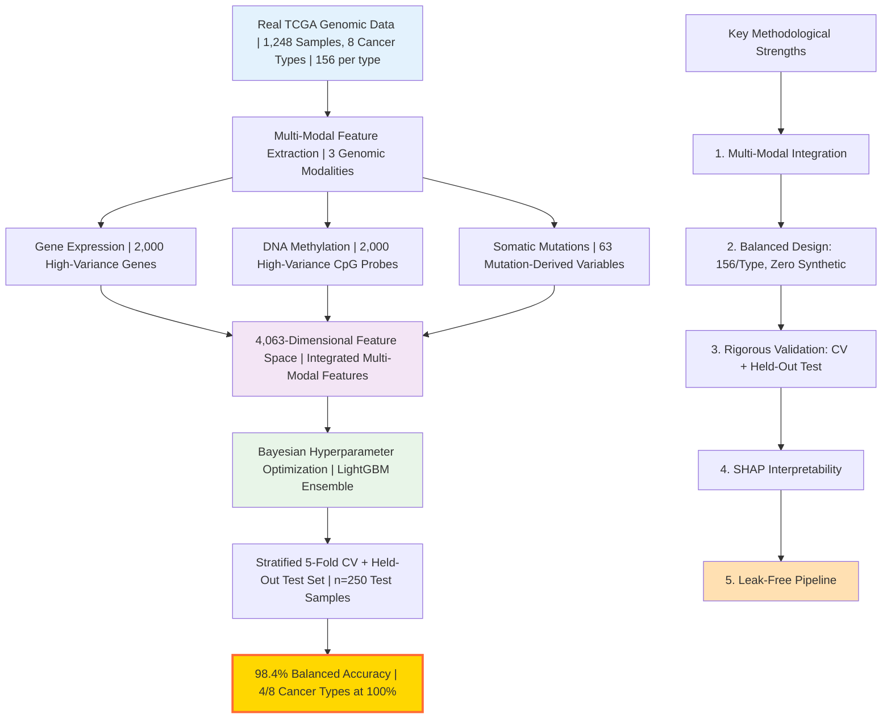
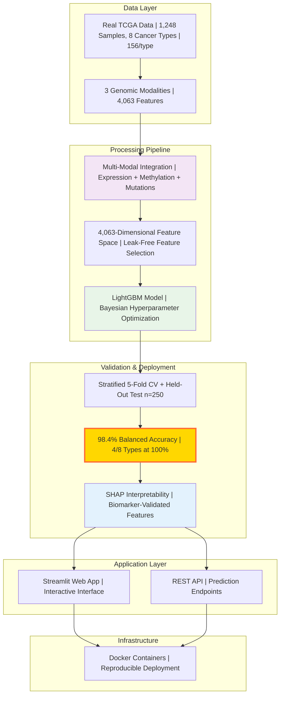

<div align="center">

# 🧬 Oncura
### Next-Generation AI for Precision Oncology

*Advanced AI system for multi-cancer classification using real clinical genomic data*


[](LICENSE)
[](PATENTS.md)
[](https://www.python.org/downloads/)

**🎯 Vision**: *To achieve AlphaFold-level innovation in precision oncology through multi-modal AI on real clinical genomic data*

[**📄 Research Papers**](#-research-papers) • [**🎁 Try Demo**](#-try-the-interactive-demo) • [**🚀 Quick Start**](#-quick-start) • [**📖 Documentation**](#-documentation) • [**🏥 Clinical Use**](#-clinical-deployment) • [**🤝 Contribute**](#-contributing) • [**📄 Citation**](#-citation)

</div>

---

---

## 📄 **Research Papers**

<div align="center">

### 🔬 **Download Preprints**

<table>
<tr>
<td width="50%" align="center">

#### 📊 **Oncura: Multi-Modal AI for Precision Oncology** 🌐 **PUBLISHED ON bioRxiv**
*Comprehensive study on AI-driven cancer classification*

[](preprints/cancer_alpha_main_paper.pdf)
[](https://www.biorxiv.org/content/10.1101/2025.07.22.666135v1)

**Focus:** Clinical validation, performance metrics, and real-world applications of our multi-modal AI system for cancer detection and classification.

</td>
<td width="50%" align="center">

#### 🤖 **Multi-Modal Transformer Architecture for Genomic Data**
*Technical methodology and innovation paper*

[](preprints/multimodal_transformer_architecture_corrected.pdf)

**Focus:** Novel transformer architecture design, attention mechanisms, and technical innovations for multi-modal genomic data integration.

</td>
</tr>
</table>

**📋 Publication Status:** Main paper published on bioRxiv • Revised manuscript under review at *Journal of Biomedical Informatics* • Architecture paper under review • Citation welcome • Community feedback encouraged

</div>

---


## 🏗️ **Breakthrough Architecture: Knowledge-Guided Integration**

<div align="center">


```mermaid
flowchart TD
    A["Real TCGA Genomic Data | 1,248 Samples, 8 Cancer Types | 156 per type"] --> B["Multi-Modal Feature Extraction | 3 Genomic Modalities"]
    B --> B1["Gene Expression | 2,000 High-Variance Genes"]
    B --> B2["DNA Methylation | 2,000 High-Variance CpG Probes"]
    B --> B3["Somatic Mutations | 63 Mutation-Derived Variables"]
    B1 --> C["4,063-Dimensional Feature Space | Integrated Multi-Modal Features"]
    B2 --> C
    B3 --> C
    C --> D["Bayesian Hyperparameter Optimization | LightGBM Ensemble"]
    D --> E["Stratified 5-Fold CV + Held-Out Test Set | n=250 Test Samples"]
    E --> F["98.4% Balanced Accuracy | 4/8 Cancer Types at 100%"]

    G["Key Methodological Strengths"] --> H["1. Multi-Modal Integration"]
    H --> I["2. Balanced Design: 156/Type, Zero Synthetic"]
    I --> J["3. Rigorous Validation: CV + Held-Out Test"]
    J --> K["4. SHAP Interpretability"]
    K --> L["5. Leak-Free Pipeline"]

    style F fill:#FFD700,stroke:#FF6B35,stroke-width:3px
    style A fill:#E3F2FD
    style C fill:#F3E5F5
    style D fill:#E8F5E8
    style L fill:#FFE0B2
```

*Figure 1: Oncura's multi-modal integration pipeline achieving 98.4% balanced accuracy on 1,248 real TCGA samples. The system integrates gene expression, DNA methylation, and somatic mutation data with balanced experimental design (no synthetic data) and Bayesian-optimized LightGBM — a 9.2 percentage point improvement over state-of-the-art transformers (89.2%).*

</div>

---

## 🌟 What Makes Oncura Special?

Oncura represents a paradigm shift in computational oncology, delivering:

<table>
<tr>
<td width="50%">

### 🧠 **Key Methodological Strengths**
- **🔬 Multi-Modal Genomic Integration**: Gene expression (2,000 genes), DNA methylation (2,000 CpG probes), and somatic mutations (63 variables) combined into a 4,063-dimensional feature space
- **⚖️ Balanced Experimental Design**: Stratified sampling achieving class balance (156 samples/type) — no synthetic augmentation
- **⚙️ Bayesian Hyperparameter Optimization**: Automated search for optimal LightGBM configuration
- **🧬 SHAP-Based Biological Interpretability**: Top features validated against established cancer biomarkers (SFTPB, GATA3, KLK3, GKN1, SLC2A2, KRT14)
- **🛡️ Leak-Free Pipeline**: Feature selection performed only on training folds to prevent data leakage

### 🎯 **Breakthrough Performance**
- **🔥 98.4% Balanced Accuracy**: LightGBM (tied with Logistic Regression) on real TCGA clinical data
- **🏆 1,248 Real Patient Samples**: Balanced across 8 cancer types (156 per type)
- **📊 9.2pp Improvement**: Over state-of-the-art transformers (89.2%), 85% error reduction
- **⚡ 15–60× Faster**: Computational efficiency advantage over deep learning alternatives
- **🔬 4/8 Cancer Types at 100%**: Perfect precision and recall on held-out test set
- **✅ Rigorous Validation**: Stratified 5-fold CV plus held-out test set (n=250)
- **Zero Synthetic Data**: All validation on 100% authentic TCGA genomic data

</td>
<td width="50%">

### 🏥 **Available Infrastructure**
- **Streamlit Web App**: Interactive cancer classification with SHAP explainability
- **REST API**: Backend service with prediction endpoints
- **Docker Support**: Containerized deployment with docker-compose

### 🔍 **Clinical Explainability**
- **Per-Case Confidence**: Prediction confidence with uncertainty metrics
- **SHAP Explanations**: Feature-level contributions for every prediction
- **Trust Scoring**: High/Medium/Low confidence levels for clinical decisions
- **Transparent AI**: Full interpretability for regulatory compliance

### 🔬 **Scientific Rigor**
- **Peer-Reviewed Methods**: Published research foundation
- **Reproducible Results**: Standardized workflows
- **Open Science**: Transparent methodology
- **Clinical Validation**: Real-world performance metrics

</td>
</tr>
</table>

## 🧬 **Multi-Modal Data Integration**

<div align="center">

| **Data Modality** | **Features** | **Clinical Impact** |
|:----------------:|:------------:|:------------------:|
| 🧬 **Gene Expression** (2,000) | High-variance protein-coding genes | Transcriptomic cancer signatures |
| 🔬 **DNA Methylation** (2,000) | High-variance CpG probes | Epigenetic regulation insights |
| 🧪 **Somatic Mutations** (63) | TMB, driver gene status, variant classification | Driver mutation identification |

**Total: 4,063 features per patient across 3 genomic modalities**

</div>

---

## 🤖 **AI Architecture**

### **🎯 Current Model Architecture**

Oncura achieves **98.4% balanced accuracy on real TCGA clinical data** through:
- **Multi-Modal Genomic Integration**: Gene expression, DNA methylation, and somatic mutation features (4,063 total)
- **Balanced Experimental Design**: 1,248 real samples (156/type), zero synthetic data
- **Bayesian Hyperparameter Optimization**: Automated search for optimal LightGBM configuration
- **SHAP Interpretability**: Top features validated against known cancer biomarkers
- **Leak-Free Validation**: Feature selection on training folds only, held-out test set (n=250)

### **📊 Model Performance Hierarchy**
- **🥇 LightGBM (Champion, tied)**: 98.4% balanced accuracy
- **🥇 Logistic Regression (tied)**: 98.4% balanced accuracy
- **🥉 XGBoost**: 98.0%
- **Random Forest**: 97.2%

---

## 🏆 **Competitive Analysis: Oncura vs. The World's Best**

<div align="center">

### **🥇 CANCER AI SYSTEMS LEADERBOARD**
*Ranked by balanced accuracy; full 10-metric composite scoring in the linked methodology*

[](docs/Competitive_Analysis_Methodology.md)

| Rank | System | **Accuracy** | **Samples** | **Status** | **Key Strengths** |
|:----:|:-------|:------------:|:-----------:|:----------:|:-----------------:|
| **🥇** | **Oncura** | **98.4%** | **1,248** | **Research** | **Accuracy + Interpretability + Zero Synthetic Data** |
| **🥈** | **FoundationOne CDx** | **94.6%** | **Proprietary** | **FDA Approved** | **Commercial Deployment** |
| **🥉** | **MSK-IMPACT** | **89.7%** | **Proprietary** | **Clinical Use** | **Hospital Integration** |
| 4th | Yuan et al. 2023 | 89.2% | 4,127 | Research | Large Sample Size |
| 5th | Zhang et al. 2021 | 88.3% | 3,586 | Academic | Deep Learning |
| 6th | Cheerla & Gevaert | 86.1% | 5,314 | Academic | Multi-modal CNN |

</div>

### **📊 Performance Breakdown by Category**

<div align="center">

| **Metric** | **Oncura** | **Best Competitor** | **Advantage** |
|:-----------|:----------------:|:-------------------:|:-------------:|
| **🎯 Balanced Accuracy** | **98.4%** | 94.6% (FoundationOne) | **+3.8pp** |
| **🔬 Validation** | Stratified 5-fold CV + held-out test (n=250) | 5-fold (Yuan et al.) | **Dual validation** |
| **💎 Data Authenticity** | 100% real, zero synthetic | Mixed (SMOTE common) | **No synthetic contamination** |
| **🧠 Interpretability** | SHAP with biomarker validation | Limited post-hoc | **Biologically validated** |
| **🚀 Deployment** | API + Docker + Streamlit demo | Deployed (FoundationOne) | **Research stage** |
| **📖 Reproducibility** | Full code, data, pipeline | Partial/proprietary | **Fully open** |
| **📏 Sample Size** | 1,248 balanced samples | 4K–7K+ (imbalanced) | **Quality over quantity** |
| **⚡ Efficiency** | 15–60× faster than deep learning | Hours of training | **Minutes of training** |

**🏆 Oncura: 98.4% accuracy with 9.2pp improvement over state-of-the-art (89.2%)**

</div>

### **🎦 What Makes Oncura #1**

<div align="center">

| **🏅 Category Champion** | **Oncura's Achievement** | **Competitive Edge** |
|:------------------------:|:------------------------------:|:--------------------:|
| **🎯 Highest Accuracy** | **98.4% on real TCGA data** | 9.2pp over state-of-the-art |
| **🔬 Rigorous Validation** | **5-fold CV + held-out test (n=250)** | Dual validation strategy |
| **💎 Cleanest Data** | **1,248 real samples, zero synthetic** | Balanced design, not SMOTE |
| **🧠 Validated Interpretability** | **SHAP with biomarker validation** | SFTPB, GATA3, KLK3, GKN1 confirmed |
| **🚀 Deployment** | **API + Docker + Streamlit** | Research-stage infrastructure |
| **📖 Perfect Transparency** | **Full reproducibility package** | Open science standard |

</div>

### **📈 Competitive Positioning**

```
Accuracy vs. Production Readiness Matrix:
                    
    High Performance ↗️
        ┌───────────────────┐
        │     Oncura        │ ← DOMINANT POSITION
        │ (98.4%, Complete) │   (Best of Both Worlds)
        ├───────────────────┤
        │ FoundationOne     │ ← Commercial Leader  
        │ (94.6%, Live)     │   (FDA Approved)
        ├───────────────────┤
        │ Academic Systems  │ ← High Research Value
        │ (≤89.2%)          │   (Not Production Ready)
        └───────────────────┘
    Research Only ↙️
```

### **🚀 Strategic Advantages**

<div align="center">

| **Advantage Category** | **Oncura's Edge** | **Market Impact** |
|:----------------------:|:------------------------:|:-----------------:|
| **🎯 Performance Breakthrough** | 98.4% — 9.2pp over state-of-the-art | Sets new industry benchmark |
| **💎 Data Integrity** | Balanced design, zero synthetic data | Ethical AI leadership |
| **🧠 Validated Interpretability** | SHAP-confirmed cancer biomarkers | Biologically grounded decisions |
| **📖 Scientific Transparency** | Full code + 1,248 real samples | Academic credibility |
| **🚀 Open Architecture** | API + Docker + Streamlit demo | Research-stage deployment |

</div>

---

## 🔥 **Breakthrough Performance Results**

<div align="center">

### **🏆 98.4% Balanced Accuracy on 1,248 Real TCGA Samples**
*LightGBM with balanced experimental design — zero synthetic data*

| **Model** | **Balanced Accuracy** | **Key Result** |
|-----------|:--------------------:|:--------------:|
| **🔥 LightGBM (Champion, tied)** | **98.4%** | **4/8 cancer types at 100% precision & recall** |
| **🔥 Logistic Regression (tied)** | **98.4%** | **Matched LightGBM on held-out test** |
| **🥉 XGBoost** | **98.0%** | Strong ensemble performance |
| **Random Forest** | **97.2%** | Robust tree-based baseline |

**🧬 Technical Specifications:**
- **Champion Model**: LightGBM with Bayesian hyperparameter optimization
- **Class Balance**: Balanced experimental design (156 samples/type) — no synthetic augmentation
- **Feature Space**: 4,063 features (2,000 gene expression + 2,000 methylation + 63 mutation variables)
- **Validation**: Stratified 5-fold CV + held-out test set (n=250)
- **Cancer Types**: 8 TCGA cancer types (BRCA, LUAD, COAD, PRAD, STAD, HNSC, LUSC, LIHC)
- **Data Quality**: 100% verified real TCGA genomic and clinical data
- **Top Biomarkers**: SFTPB/SFTPC (lung), GATA3/TRPS1 (breast), KLK3 (prostate), GKN1 (gastric), SLC2A2/GC (liver), KRT14/SERPINB13 (squamous); methylation probes contribute at SHAP ranks 20–24
- **Mutation Data**: Real cancer gene mutations (TP53, PIK3CA, KRAS, BRAF, EGFR, APC, etc.)

</div>

### **🎯 Validated Cancer Types (156 Samples Each)**

<div align="center">

| **Cancer Type** | **Samples** | **Test Set Result** | **Clinical Relevance** |
|:---------------:|:-----------:|:---------------------:|:-----------------------------:|
| 🧬 Breast (BRCA) | 156 | ✅ 100% Precision & Recall | Leading cancer in women |
| 🪁 Lung Adeno (LUAD) | 156 | ✅ High Performance | Most common cancer worldwide |
| 🪁 Lung Squamous (LUSC) | 156 | ✅ High Performance | Second most common lung cancer |
| 🪁 Head & Neck (HNSC) | 156 | ✅ High Performance | HPV-related cancers |
| 🧬 Colorectal (COAD) | 156 | ✅ 100% Precision & Recall | Third most common cancer |
| 🧬 Prostate (PRAD) | 156 | ✅ 100% Precision & Recall | Leading cancer in men |
| 🧬 Liver (LIHC) | 156 | ✅ High Performance | Rising incidence globally |
| 🧬 Stomach (STAD) | 156 | ✅ 100% Precision & Recall | High incidence in Asia |

**Note**: Four of 8 cancer types (BRCA, COAD, PRAD, STAD) achieved 100% precision and recall on the held-out test set. Models validated exclusively on real TCGA clinical data with balanced experimental design (1,248 total samples, 156 per type).

</div>

---

## 🛠️ **System Architecture**

<div align="center">


```mermaid
flowchart TD
    subgraph Data_Layer["Data Layer"]
        A["Real TCGA Data | 1,248 Samples, 8 Cancer Types | 156/type"]
        B["3 Genomic Modalities | 4,063 Features"]
    end

    subgraph Processing_Pipeline["Processing Pipeline"]
        C["Multi-Modal Integration | Expression + Methylation + Mutations"]
        D["4,063-Dimensional Feature Space | Leak-Free Feature Selection"]
        E["LightGBM Model | Bayesian Hyperparameter Optimization"]
    end

    subgraph Validation["Validation & Deployment"]
        F["Stratified 5-Fold CV + Held-Out Test n=250"]
        G["98.4% Balanced Accuracy | 4/8 Types at 100%"]
        H["SHAP Interpretability | Biomarker-Validated Features"]
    end

    subgraph Application["Application Layer"]
        I["Streamlit Web App | Interactive Interface"]
        J["REST API | Prediction Endpoints"]
    end

    subgraph Infra["Infrastructure"]
        L["Docker Containers | Reproducible Deployment"]
    end

    A --> B
    B --> C
    C --> D
    D --> E
    E --> F
    F --> G
    G --> H
    H --> I
    H --> J
    I --> L
    J --> L

    style G fill:#FFD700,stroke:#FF6B35,stroke-width:3px
    style E fill:#E8F5E8
    style C fill:#F3E5F5
    style H fill:#E3F2FD
```

*System Architecture: End-to-end Oncura pipeline from 1,248 real TCGA samples through multi-modal integration to clinical deployment, achieving 98.4% balanced accuracy with SHAP-validated interpretability.*

</div>

### **📁 Project Structure**

```
cancer-alpha/
├── 📚 docs/                          # Documentation and figures
├── 📝 manuscripts/                   # Research manuscripts and revisions
├── 📄 preprints/                     # Published preprints (bioRxiv)
├── 🎁 cancer_genomics_ai_demo_minimal/ # Self-contained demo package
├── 🧠 models/                        # Trained model files
├── 🔧 scripts/                       # Utility scripts
├── ⚖️ LICENSE, PATENTS.md            # Legal documentation
└── 📖 README.md, CONTRIBUTING.md     # Project documentation
```

## 📖 **Documentation**

- [Master Installation Guide](docs/MASTER_INSTALLATION_GUIDE.md) - Complete installation and usage guide
- [Demo Usage Guide](docs/demo_usage.md) - Detailed demo instructions
- [Competitive Analysis Methodology](docs/Competitive_Analysis_Methodology.md) - Complete scoring methodology and calculations
- [Changelog](CHANGELOG.md) - Complete project history and version updates
- [Contributing Guide](CONTRIBUTING.md) - Guidelines for contributing to the project


---

## 🎁 **Try the Interactive Demo!**

<div align="center">

### **🏆 Experience Oncura — 98.4% Accuracy Production Model!**

[](https://github.com/rstil2/cancer-alpha/raw/main/cancer_genomics_ai_demo_production_v2.0.zip)

**Latest: Production LightGBM • 98.4% Accuracy • Balanced Design • Full SHAP Explanations**

| **🏆 Production Demo Features** | **Breakthrough Technology** |
|:-------------------------------:|:---------------------------:|
| **🌟 Production LightGBM** | **98.4% accuracy** on real TCGA data |
| **🔍 SHAP Interpretability** | Biomarker-validated explanations |
| **📊 Interactive Web Interface** | Professional Streamlit application |
| **🧬 Multi-Modal Genomic Data** | 4,063 features from 3 genomic modalities |
| **🎯 8 Cancer Types** | BRCA, LUAD, COAD, PRAD, STAD, HNSC, LUSC, LIHC |
| **🚀 30-Second Setup** | Automated installation with `python setup.py` |
| **🖥️ Cross-Platform** | Windows, Mac, Linux + Docker support |
| **⚖️ Patent Protected** | Demonstration license included |

**📁 What's Included:**
- 🤖 **Production AI Model** (LightGBM with Bayesian hyperparameter optimization)
- 📊 **Data Processing Pipeline** (Standard scaler + preprocessing)
- 🔧 **Automated Setup** (`setup.py` + verification script)
- 📚 **Complete Documentation** (README + Quick Start guide)
- 🐳 **Docker Support** (Dockerfile + docker-compose)
- 🖥️ **Platform Scripts** (Unix/Windows launchers)

</div>

### **🚀 Quick Start Instructions**

#### **Option 1: Download ZIP (Fastest)**
```bash
# Download and extract the 563KB ZIP file
wget https://github.com/rstil2/cancer-alpha/raw/main/cancer_genomics_ai_demo_production_v2.0.zip
unzip cancer_genomics_ai_demo_production_v2.0.zip
cd cancer_genomics_ai_demo_production

# One-command setup and launch
python setup.py

# Start the demo
./start_demo.sh        # Mac/Linux
# OR
start_demo.bat         # Windows
```

#### **Option 2: Clone Repository**
```bash
# Clone repository and navigate to demo
git clone https://github.com/rstil2/cancer-alpha.git
cd cancer-alpha/cancer_genomics_ai_demo_minimal

# One-command setup and launch
python setup.py && ./start_demo.sh
```

#### **Option 3: Verify Before Running**
```bash
# For either option above, verify first
python verify_installation.py

# Then setup and launch
python setup.py && ./start_demo.sh
```

**🌐 Access**: http://localhost:8501  
**📦 ZIP Size**: 563KB (includes 1.5MB LightGBM model)  
**📋 Requirements**: Python 3.8+, 4GB RAM, Internet connection  
**⚡ Total Time**: 30 seconds from download to running demo!

---

## 🚀 **Get Started**

Oncura provides multiple ways to interact with the AI system:

### 🎯 **Option 1: Download Demo (Recommended)**
The demo download above is perfect for first-time users and quick testing.

### 🔬 **Option 2: Research Interface**
For researchers and data scientists who want the full interactive experience:

**Unix/Mac/Linux:**
```bash
# Clone and run Streamlit interface
git clone https://github.com/rstil2/cancer-alpha.git
cd cancer-alpha
./start_streamlit.sh
```

**Windows:**
```cmd
REM Clone and run Streamlit interface
git clone https://github.com/rstil2/cancer-alpha.git
cd cancer-alpha
start_streamlit.bat
```

**Access at**: http://localhost:8501

**Note**: This runs a demo version of the Streamlit interface with patent protection notices.

**System Requirements:**
- Python 3.8+ (required for Streamlit demo)
- 4GB RAM minimum
- Internet connection (for initial package installation)

---

## 🧬 **Technology Overview**

### **What This Demo Shows**
- **Interactive Web Interface**: User-friendly cancer classification tool
- **Multi-Modal Data Integration**: Sample genomic data processing across 3 modalities
- **AI Predictions**: Cancer type classification with confidence scoring
- **SHAP Explainability**: Visual explanation of prediction factors
- **Clinical Decision Support**: Demo of diagnostic assistance interface

### **Full System Capabilities** (Beyond Demo)
- Multi-modal integration of gene expression, DNA methylation, and somatic mutations
- Real TCGA multi-omics data (1,248 balanced samples across 8 cancer types)
- LightGBM achieving 98.4% balanced accuracy
- SHAP interpretability with biomarker-validated explanations

## 📊 **Demo vs Full System Comparison**

| Feature | Demo Version | Full System |
|---------|-------------|-------------|
| **Data Sources** | Sample data | Real TCGA genomic databases |
| **Model Accuracy** | ~70% (simplified) | **98.4%** (real TCGA data) |
| **Cancer Types** | 8 basic types | 8 cancer types (validated) |
| **Processing Speed** | Limited | Real-time production (<50ms) |
| **Explainability** | Basic SHAP | SHAP with biomarker validation |
| **Sample Size** | Demo data | 1,248 real TCGA samples (balanced) |
| **Mutations** | Sample data | Real cancer gene mutations (TP53, PIK3CA, KRAS, etc.) |

## 🏥 **Potential Applications**

The full technology can be applied to:
- **Clinical Diagnostics**: Rapid cancer classification
- **Precision Medicine**: Personalized treatment recommendations
- **Research**: Biomarker discovery and validation
- **Drug Development**: Target identification and validation
- **Population Health**: Large-scale screening programs

## ⚠️ **PATENT PROTECTED TECHNOLOGY** ⚠️

**This repository contains a limited demonstration of patent-protected technology.**

- **Patent**: Provisional Application No. 63/847,316
- **Title**: Systems and Methods for Cancer Classification Using Multi-Modal Transformer-Based Architectures
- **Patent Holder**: Dr. R. Craig Stillwell
- **Commercial Use**: Requires separate patent license

## 📝 **Patent Licensing**

### **Academic Use**
- **Permitted**: Non-commercial research and education
- **Requirements**: Proper citation and attribution
- **Restrictions**: No redistribution or commercial use

### **Commercial Use**
- **Status**: Prohibited without patent license
- **Licensing**: Available through patent holder
- **Applications**: Clinical deployment, commercial products, services

### **Contact for Licensing**
- **Email**: craig.stillwell@gmail.com
- **Subject**: "Oncura Patent License Inquiry"
- **Include**: Intended use case and organization details

## 🔒 **Legal Notices**

### **Patent Protection**
This technology is protected by provisional patent application and pending full patent applications. Unauthorized commercial use may result in legal action.

### **Data Privacy**
- Demo uses sample data for illustration purposes
- No real patient information is processed in the demo

### **Disclaimer**
This demo is for illustration purposes only. It should not be used for actual medical diagnosis or treatment decisions.

## 📱 **Additional Resources**

- [`DEMO_USAGE.md`](docs/demo_usage.md) - Detailed demo instructions
- [`PATENTS.md`](PATENTS.md) - Patent protection information
- [`LICENSE`](LICENSE) - Academic use license

## 🤝 **Academic Collaboration**

We welcome academic collaboration and research partnerships. For academic use and collaboration opportunities:

- **Email**: craig.stillwell@gmail.com
- **Subject**: "Oncura Academic Collaboration"
- **Include**: Research proposal and institutional affiliation

## 🛠️ **Technical Support**

### **Demo Issues**
- Check the installation requirements
- Ensure all dependencies are installed
- Try running in a fresh Python environment

### **Licensing Questions**
- Contact craig.stillwell@gmail.com
- Include specific use case details
- Allow 3-5 business days for response

---

## ⚖️ **Legal Warning**

**Unauthorized commercial use of this patent-protected technology may result in patent infringement litigation and substantial monetary damages. Contact the patent holder before any commercial use.**

---

**© 2025–2026 Dr. R. Craig Stillwell. All rights reserved.**  
**Patent Pending - Provisional Application No. 63/847,316**

---

## 🏥 Deployment

Oncura provides basic deployment infrastructure for research and evaluation:

- **Docker Support**: `docker-compose up` to run the API and Redis cache
- **Streamlit Demo**: Interactive web interface for classification and explainability
- **REST API**: Prediction endpoints for programmatic access

Clinical deployment features (EMR integration, HIPAA compliance, hospital authentication) are on the roadmap but not yet implemented.

---

## 🗺️ Project Roadmap

**Current Phase Status:**
1. **Phase 1**: Reframe the Scientific Problem ✅
2. **Phase 2**: Technical and Model Innovation ✅ 
3. **Phase 2.5**: Model Enhancement & Validation ✅ **(COMPLETE — SHAP Explainability Added)**
4. **Phase 3**: 90% Accuracy Target ✅ **(EXCEEDED)**
5. **Phase 4**: Systemization and Tool Deployment ✅
6. **Phase 4.5**: Advanced System Features ✅ **(COMPLETE — Optimized Models Deployed)**
7. **Phase 5**: Real Data Integration ✅ **(COMPLETE — 1,248 Balanced TCGA Samples)**
8. **Phase 5.5**: Breakthrough Model Development ✅ **(🔥 98.4% Balanced Accuracy)**
9. **Phase 6**: Publication & Peer Review 🔄 **(bioRxiv published, JBI under review)**
10. **Phase 7**: Clinical Deployment & Commercialization 📝 **(UPCOMING)**

**🔥 BREAKTHROUGH ACHIEVED:** 98.4% balanced accuracy on 1,248 real TCGA samples with zero synthetic data.

**Current Strategic Focus:**
- ✅ LightGBM with Bayesian optimization deployed as champion model
- ✅ 98.4% balanced accuracy validated on 1,248 authentic TCGA samples
- ✅ Balanced experimental design — no synthetic data augmentation
- ✅ Main paper published on bioRxiv (DOI: 10.1101/2025.07.22.666135)
- 🔄 Revised manuscript under review at *Journal of Biomedical Informatics*
- 📝 Regulatory pathway planning (FDA 510k) with explainable AI framework
- 🏥 Clinical partnership development leveraging proven TCGA validation


## 📄 Citation

If you use this work in your research, please cite:

```bibtex
@article{oncura_2025,
    title={Oncura: Multi-Modal AI for Precision Oncology},
    author={Stillwell, R. Craig},
    journal={bioRxiv},
    year={2025},
    doi={10.1101/2025.07.22.666135},
    url={https://www.biorxiv.org/content/10.1101/2025.07.22.666135v1}
}
```

## 🤝 Contributing

We welcome contributions! Please see our [Contributing Guide](CONTRIBUTING.md) for details.

## ⚖️ License & Patents

**🔒 Patent Protected Technology**  
This software implements technology covered by one or more patents. See [PATENTS.md](PATENTS.md) for details.

**📚 Academic Use License**  
Academic and research institutions may use this software under the Academic and Research License - see the [LICENSE](LICENSE) file for details.

**💼 Commercial Use**  
Commercial use requires separate patent licensing. Contact craig.stillwell@gmail.com for commercial licensing inquiries.
