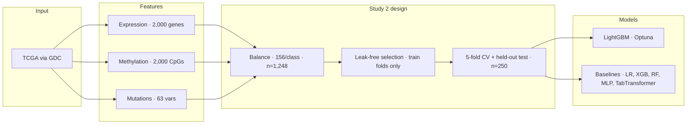

<div align="center">

# Oncura

**Multi-modal cancer classification from TCGA genomics**

*Research codebase and interactive demo — [RESEARCH.md](RESEARCH.md) is the entry point for reproduction and canonical numbers.*

[](https://www.biorxiv.org/content/10.1101/2025.07.22.666135v1)
[](science/Combined_Manuscript_JBI.pdf)
[](https://www.python.org/downloads/)
[](LICENSE)

[**Paper**](#research) · [**Results**](#results) · [**Reproduce**](#reproduce-the-paper) · [**Demo**](#interactive-demo) · [**Docs**](#documentation) · [**Cite**](#citation)

</div>

---

## At a glance

**Oncura** is an open research project asking a practical question for precision oncology ML: *when sample sizes are small and data are multi-modal, does experimental design matter more than model architecture?*

Across two complementary TCGA studies, the answer is **yes** — balanced sampling, leakage control, and integrative feature construction consistently outperform architectural complexity. Gradient boosting reaches **98.4%** held-out balanced accuracy on 1,248 real balanced samples (Study 2); with only **158** imbalanced samples, LightGBM + SMOTE still reaches **95.0%**, ahead of transformers by 11.8 pp (Study 1).

> **Research only.** This software is not a medical device and must not be used for diagnosis or treatment decisions. Study 2 results are on an internal TCGA held-out split; external clinical validation remains future work.

**Author:** [R. Craig Stillwell, PhD](mailto:craig.stillwell@gmail.com)

---

## Research

### Manuscript (under review)

**[*Experimental Design Dominates Model Architecture in Multi-Modal Cancer Classification*](science/Combined_Manuscript_JBI.pdf)**  
*Journal of Biomedical Informatics* — submitted June 2026

| Resource | Link |
|----------|------|
| Submitted PDF | [`science/Combined_Manuscript_JBI.pdf`](science/Combined_Manuscript_JBI.pdf) |
| Revision workspace (reviewer prep) | [`science/jbi_revision/`](science/jbi_revision/) |
| Canonical numbers | [`science/jbi_revision/supplementary/CANONICAL_RESULTS.md`](science/jbi_revision/supplementary/CANONICAL_RESULTS.md) |
| Reproduction guide | [`science/jbi_revision/supplementary/REPRODUCTION_GUIDE.md`](science/jbi_revision/supplementary/REPRODUCTION_GUIDE.md) |

### Preprint

Stillwell RC. *Oncura: Multi-Modal AI for Precision Oncology.* bioRxiv 2025.  
DOI: [10.1101/2025.07.22.666135](https://www.biorxiv.org/content/10.1101/2025.07.22.666135v1)

The JBI manuscript extends the preprint with a unified two-study design, expanded limitations, and VC-dimension framing. Cite the preprint for now; update when JBI publishes.

---

## Two complementary studies

The paper evaluates the **same 8-cancer classification task** under contrasting data regimes:

| | **Study 1 — small-n** | **Study 2 — large balanced** |
|---|------------------------|------------------------------|
| **Samples** | 158 real TCGA | 1,248 real TCGA (156/class) |
| **Features** | 110 (6 modalities) | 4,063 (expression + methylation + mutations) |
| **Balance** | Natural imbalance + **SMOTE** | Stratified subsampling, **no synthetic data** |
| **Cancer types** | BRCA, LUAD, COAD, PRAD, STAD, HNSC, **KIRC**, LIHC | Same panel except **LUSC** replaces KIRC |
| **Architectures** | 12 (logistic regression → transformers) | 6 (+ MLP, TabTransformer baselines) |
| **Best model** | LightGBM + SMOTE | LightGBM (tied with logistic regression) |
| **Balanced accuracy** | **95.0% ± 5.4%** | **98.4%** (held-out test, n=250) |
| **External validation** | ICGC ARGO (n=76): **92.1%** | Internal TCGA split only |
| **Key insight** | Inverse complexity–accuracy (R² = 0.78) | Classical models converge within 1.2 pp; deep learning lags 4.8–6.8 pp |

Study 1 shows what works when data are scarce; Study 2 shows what happens when adequate real data are curated with rigorous design. They are **complementary regimes**, not one longitudinal cohort.

---

## Results

### Study 2 — held-out test set (canonical pipeline)

Reproduced by [`src/pipeline/step4_train_evaluate.py`](src/pipeline/step4_train_evaluate.py) → [`data/real_model_results/model_results.json`](data/real_model_results/model_results.json)

| Model | CV balanced accuracy | Test balanced accuracy |
|-------|---------------------:|-----------------------:|
| LightGBM | 97.8% ± 0.5% | **98.4%** |
| Logistic regression | 97.0% ± 1.0% | **98.4%** |
| XGBoost | 96.8% ± 0.7% | 98.0% |
| Random forest | 96.0% ± 0.3% | 97.2% |
| MLP (6-layer) | 92.8% ± 2.1% | 93.6% |
| TabTransformer | 90.4% ± 2.8% | 91.6% |

Four cancer types (BRCA, COAD, PRAD, STAD) reached 100% precision and recall on the held-out test set. Remaining errors cluster in squamous subtypes (LUSC/HNSC) with known molecular overlap.

### Study 1 — small-n with external check

| Result | Value |
|--------|------:|
| LightGBM + SMOTE | 95.0% ± 5.4% |
| Multi-modal transformer | 83.2% ± 6.8% |
| ICGC ARGO (no retraining) | 92.1% ± 6.8% |

---

## Pipeline


```mermaid
flowchart LR
    subgraph Input
        TCGA["TCGA via GDC"]
    end
    subgraph Features
        E["Expression · 2,000 genes"]
        M["Methylation · 2,000 CpGs"]
        S["Mutations · 63 vars"]
    end
    subgraph Study2["Study 2 design"]
        B["Balance · 156/class · n=1,248"]
        L["Leak-free selection · train folds only"]
        V["5-fold CV + held-out test · n=250"]
    end
    subgraph Models
        GB["LightGBM · Optuna"]
        BL["Baselines · LR, XGB, RF, MLP, TabTransformer"]
    end
    TCGA --> E & M & S
    E & M & S --> B --> L --> V
    V --> GB & BL
```

**Modalities (Study 2):** gene expression (log2-TPM+1), DNA methylation (beta values), somatic mutations (TMB, COSMIC drivers, variant classes).

**Interpretability:** SHAP analysis; top features align with known markers (SFTPB/SFTPC, GATA3/TRPS1, KLK3, GKN1, KRT14).

---

## Reproduce the paper

Study 2 results come from the **canonical pipeline** only. Legacy root-level scripts and the public demo are **not** used for manuscript numbers.

```bash
git clone https://github.com/rstil2/cancer-alpha.git
cd cancer-alpha
python -m venv .venv && source .venv/bin/activate
pip install -r requirements.txt

# If feature pickles exist in data/real_model_results/:
python src/pipeline/step4_train_evaluate.py

# Full pipeline from GDC-mapped files:
python src/pipeline/step1_file_mapping.py
python src/pipeline/step2_expression_features.py
python src/pipeline/step2b_methylation_features.py
python src/pipeline/step3_mutation_features.py
python src/pipeline/step4_train_evaluate.py
```

Expected LightGBM test balanced accuracy: **~98.4%**. See the [reproduction guide](science/jbi_revision/supplementary/REPRODUCTION_GUIDE.md) for details.

---

## Interactive demo

The demo is a **separate, lightweight Streamlit app** for exploring the interface — it uses sample data and does **not** reproduce the 98.4% research result.

| | Research pipeline | Interactive demo |
|---|-------------------|------------------|
| Data | Real TCGA (GDC) | Sample / illustrative data |
| Accuracy | 98.4% (Study 2) | ~70% (simplified) |
| Purpose | Paper reproduction | UI exploration |

### Quick start

```bash
git clone https://github.com/rstil2/cancer-alpha.git
cd cancer-alpha/cancer_genomics_ai_demo_minimal
python setup.py
./start_demo.sh          # macOS / Linux
# start_demo.bat         # Windows
```

Open **http://localhost:8501**

Or download the packaged demo: [`cancer_genomics_ai_demo_production_v2.0.zip`](https://github.com/rstil2/cancer-alpha/raw/main/cancer_genomics_ai_demo_production_v2.0.zip)

Docker (API + cache): `docker-compose up` from the demo directory.

---

## Project layout

```
cancer-alpha/
├── src/pipeline/              # Canonical Study 2 reproduction (paper)
├── src/pipeline_study1/       # Study 1 reproduction map
├── experiments/               # Robustness tests (imbalance stress, etc.)
├── archive/                   # Legacy scripts & business docs (not for papers)
├── cancer_genomics_ai_demo_minimal/  # Streamlit demo (not paper data)
├── docs/                      # Installation & usage guides
├── manuscripts/               # Submission history & reviewer responses
├── preprints/                 # bioRxiv materials
├── models/                    # Saved model artifacts
└── README.md                  # This file
```

---

## Documentation

- [Research entry point](RESEARCH.md)
- [Canonical results](docs/CANONICAL.md)
- [Data access & reproduction](docs/DATA_ACCESS.md)
- [Master Installation Guide](docs/MASTER_INSTALLATION_GUIDE.md)
- [Demo Usage](docs/demo_usage.md)
- [Changelog](CHANGELOG.md)
- [Contributing](CONTRIBUTING.md)
- [Manuscript archive index](docs/MANUSCRIPT_ARCHIVE.md)
- [Legacy root scripts](LEGACY_SCRIPTS.md)
- [Patents & licensing](PATENTS.md)

---

## Citation

```bibtex
@article{stillwell2025oncura,
  title   = {Oncura: Multi-Modal AI for Precision Oncology},
  author  = {Stillwell, R. Craig},
  journal = {bioRxiv},
  year    = {2025},
  doi     = {10.1101/2025.07.22.666135},
  url     = {https://www.biorxiv.org/content/10.1101/2025.07.22.666135v1}
}
```

When the JBI manuscript is published, cite:

```bibtex
@article{stillwell2026experimental,
  title   = {Experimental Design Dominates Model Architecture in Multi-Modal Cancer Classification: A Translational Bioinformatics Analysis Across Small-n and Large-n Regimes},
  author  = {Stillwell, R. Craig},
  journal = {Journal of Biomedical Informatics},
  year    = {2026},
  note    = {Under review}
}
```

---

## License & contact

Academic and non-commercial research use permitted under the [LICENSE](LICENSE). Commercial use requires a separate agreement — contact **craig.stillwell@gmail.com**.

A provisional patent (No. 63/847,316) was filed in 2024 and has **lapsed**; no patent is in force. See [PATENTS.md](PATENTS.md).

---

## Contributing

Issues and pull requests welcome for reproducibility, documentation, and robustness analyses. See [CONTRIBUTING.md](CONTRIBUTING.md).

---

<div align="center">

**© 2025–2026 Dr. R. Craig Stillwell**

*Research software for multi-modal cancer genomics — not for clinical use.*

</div>
