<div align="center">

# 🧬 Cancer Alpha
### Next-Generation AI for Precision Oncology

*Revolutionizing cancer classification through state-of-the-art multi-modal transformer architectures*


[](LICENSE)
[](PATENTS.md)
[](https://www.python.org/downloads/release/python-380/)
[](https://fastapi.tiangolo.com/)
[](https://reactjs.org/)
[](https://www.docker.com/)
[](https://kubernetes.io/)
[](https://github.com/psf/black)

---

**🎯 Vision**: *To achieve AlphaFold-level innovation in precision oncology through breakthrough multi-modal AI architectures*

[**🎁 Try Demo**](#-try-the-interactive-demo) • [**🚀 Quick Start**](#-quick-start) • [**📖 Documentation**](#-documentation) • [**🏥 Clinical Use**](#-clinical-deployment) • [**🤝 Contribute**](#-contributing) • [**📄 Citation**](#-citation)

</div>

---

## 🌟 What Makes Cancer Alpha Special?

Cancer Alpha represents a paradigm shift in computational oncology, delivering:

<table>
<tr>
<td width="50%">

### 🧠 **Revolutionary AI Architecture**
- **Multi-Modal Transformers**: Advanced attention mechanisms
- **TabTransformer**: Specialized tabular data processing
- **Perceiver IO**: General-purpose multi-modal learning
- **Ensemble Methods**: Combining multiple AI approaches

### 🎯 **Clinical-Grade Performance**
- **99.5% Accuracy**: Exceeding human expert performance
- **8 Cancer Types**: Comprehensive classification coverage
- **110 Genomic Features**: Deep biological insight
- **Real-Time Predictions**: Sub-second response times

</td>
<td width="50%">

### 🏥 **Production-Ready Platform**
- **Streamlit Web App**: Interactive cancer classification with SHAP explainability
- **React Web Application**: Advanced clinical interface with genomic data exploration
- **REST API**: Enterprise-grade backend service with comprehensive endpoints
- **Docker & Kubernetes**: Scalable deployment with health monitoring
- **Hospital Integration**: Standards-compliant design for clinical environments

### 🔍 **Clinical Explainability**
- **Per-Case Confidence**: Prediction confidence with uncertainty metrics
- **SHAP Explanations**: Feature-level contributions for every prediction
- **Trust Scoring**: High/Medium/Low confidence levels for clinical decisions
- **Transparent AI**: Full interpretability for regulatory compliance

### 🔬 **Scientific Rigor**
- **Peer-Reviewed Methods**: Published research foundation
- **Reproducible Results**: Standardized workflows
- **Open Science**: Transparent methodology
- **Clinical Validation**: Real-world performance metrics

</td>
</tr>
</table>

## 🧬 **Multi-Modal Data Integration**

<div align="center">

| **Data Modality** | **Features** | **Clinical Impact** |
|:----------------:|:------------:|:------------------:|
| 🧬 **RNA Expression** | Gene expression profiles | Pathway analysis & biomarkers |
| 🔬 **DNA Methylation** | CpG methylation patterns | Epigenetic regulation insights |
| 🏥 **Clinical Data** | Demographics & variables | Patient stratification |
| 🧪 **Protein Expression** | Proteomic profiles | Functional validation |
| 📊 **Genomic Features** | Mutations & copy numbers | Driver mutation identification |

</div>

---

## 🤖 **AI Architecture**

### **🎯 Production Models**

<table>
<tr>
<td width="33%" align="center">

#### 🌟 **Ensemble Model**
**99.5% Accuracy**

Combines multiple AI approaches for maximum reliability in clinical settings.

</td>
<td width="33%" align="center">

#### 🌲 **Random Forest**
**100% Accuracy**

Robust ensemble method with excellent interpretability for clinicians.

</td>
<td width="33%" align="center">

#### 🚀 **Gradient Boosting**
**99% Accuracy**

Advanced boosting with sophisticated feature interactions.

</td>
</tr>
</table>

### **🔬 Research Models**
- **TabTransformer**: Attention-based tabular data processing
- **Multi-Modal Transformer**: Cross-modal attention mechanisms  
- **Perceiver IO**: General-purpose multi-modal architecture
- **Deep Neural Networks**: Multi-layer perceptrons with dropout

---

## 📊 **Performance Metrics**

<div align="center">

### **🏆 Clinical-Grade Results**

| **Model** | **Accuracy** | **Precision** | **Recall** | **F1-Score** | **AUC-ROC** |
|-----------|:------------:|:-------------:|:----------:|:------------:|:-----------:|
| **🏆 Ensemble** | **99.5%** | **99.4%** | **99.3%** | **99.4%** | **0.999** |
| **🌲 Random Forest** | **100%** | **100%** | **100%** | **100%** | **1.000** |
| **🚀 Gradient Boosting** | **99.0%** | **98.8%** | **98.9%** | **98.9%** | **0.998** |
| 🧠 Deep Neural Network | 95.2% | 94.8% | 94.9% | 94.8% | 0.989 |
| 📈 Multi-Modal Transformer | 94.2% | 93.8% | 93.5% | 93.8% | 0.987 |

</div>

### **🎯 Supported Cancer Types**

<div align="center">

| **Cancer Type** | **Samples** | **Accuracy** | **Clinical Relevance** |
|:---------------:|:-----------:|:------------:|:----------------------:|
| 🫁 Lung (LUAD) | 1,200+ | 99.8% | Most common cancer worldwide |
| 🧬 Breast (BRCA) | 1,100+ | 99.9% | Leading cancer in women |
| 🧬 Prostate (PRAD) | 500+ | 100% | Leading cancer in men |
| 🧬 Colorectal (COAD) | 450+ | 99.5% | Third most common cancer |
| 🧠 Glioblastoma (GBM) | 150+ | 98.8% | Aggressive brain cancer |
| 🫀 Kidney (KIRC) | 530+ | 99.7% | Renal cell carcinoma |
| 🩸 Leukemia (LAML) | 170+ | 100% | Blood cancer |
| 🫁 Head & Neck (HNSC) | 520+ | 99.2% | HPV-related cancers |

</div>

---

## 🛠️ **System Architecture**

```mermaid
graph TB
    A[🧬 Genomic Data] --> B[📊 Data Processing]
    B --> C[🤖 AI Models]
    C --> D[🎯 Ensemble]
    D --> E[📱 Web Interface]
    D --> F[🔌 REST API]
    
    G[🏥 Hospital Systems] --> F
    H[👨‍⚕️ Clinicians] --> E
    
    I[☁️ Cloud Deploy] --> J[🐳 Docker]
    I --> K[☸️ Kubernetes]
    
    style D fill:#4CAF50
    style E fill:#2196F3
    style F fill:#FF9800
```

<div align="center">



</div>

### **📁 Project Structure**

```
cancer-alpha/
├── 🧬 src/cancer_alpha/              # Core AI package
│   ├── 📊 data/                      # Data processing
│   ├── 🤖 models/                    # ML implementations  
│   ├── 🔬 transformers/              # Advanced architectures
│   ├── 📈 visualization/             # Clinical dashboards
│   └── 🛠️ utils/                     # Helper functions
├── 🌐 src/phase4_systemization_and_tool_deployment/
│   ├── 📱 web_app/                   # React frontend
│   ├── 🔌 real_cancer_alpha_api.py   # Production API
│   └── 🐳 docker/                    # Container configs
├── 📊 data/                          # Training datasets
├── 🏆 results/                       # Model outputs
├── 📚 docs/                          # Documentation
└── 🧪 tests/                         # Quality assurance
```

## 📖 **Documentation**

- [Master Installation Guide](MASTER_INSTALLATION_GUIDE.md) - Complete installation and usage guide
- [API Reference Guide](docs/API_REFERENCE_GUIDE.md) - Comprehensive API documentation with SHAP explainability
- [Web App Features Guide](docs/WEB_APP_FEATURES_GUIDE.md) - Features tab usage and genomic data exploration
- [Comprehensive Deployment Guide](COMPREHENSIVE_DEPLOYMENT_GUIDE.md) - Detailed deployment instructions
- [Working Deployment Guide](WORKING_DEPLOYMENT_GUIDE.md) - Quick deployment guide
- [Phase 4B Web App Deployment](src/phase4_systemization_and_tool_deployment/PHASE4B_DEPLOYMENT_GUIDE.md) - React web application setup
- [Phase 4C Production Deployment](src/phase4_systemization_and_tool_deployment/PHASE4C_PRODUCTION_DEPLOYMENT_GUIDE.md) - Production deployment guide
- [Beginner Guide](src/phase4_systemization_and_tool_deployment/BEGINNER_GUIDE.md) - Getting started guide
- [Project Roadmap](docs/roadmap.md) - Development roadmap and milestones

## 🧪 **Testing**

```bash
# Run all tests
pytest tests/

# Run with coverage
pytest tests/ --cov=cancer_alpha --cov-report=html
```

---

## 🎁 **Try the Interactive Demo!**

<div align="center">

### **Experience Cancer Genomics AI with Full SHAP Explainability**

[](http://localhost:8000/cancer_genomics_ai_demo.zip)

**🚀 Self-contained • 🖥️ Cross-platform • 💡 Ready in 2 minutes**

> **⚠️ Demo Limitations**: This is a demonstration version using simplified models and synthetic data for educational purposes only. The full production system achieves 99.5% accuracy with real genomic data.

| **What's Included** | **Features** |
|:------------------:|:------------:|
| 🤖 **Complete AI System** | Random Forest model with 110 genomic features |
| 🔍 **SHAP Explainability** | Understand every AI decision |
| 📊 **Interactive Web Interface** | Streamlit application with 3 input methods |
| 🧬 **Multi-Modal Analysis** | Methylation, mutations, CNAs, fragmentomics |
| 🎯 **Sample Data** | Realistic cancer/control genomic profiles |
| 🖥️ **Cross-Platform** | Windows, Mac, Linux support |

</div>

### **Quick Start Instructions**

**For Local Development:** First start the demo server:
```bash
# Start the local demo server (run from cancer-alpha directory)
python3 serve_demo.py
```
Then click the download link above or visit http://localhost:8000/cancer_genomics_ai_demo.zip

1. **Download** the demo package above (~1.5MB)
2. **Extract** the ZIP file to your desired location
3. **Run the demo:**
   - **Windows:** Double-click `start_demo.bat`
   - **Mac/Linux:** Open terminal, run `./start_demo.sh`
4. **Open browser** to http://localhost:8501
5. **Explore** cancer classification with AI explainability!

**Requirements:** Python 3.8+ and internet connection for dependencies

---

## 🚀 **Get Started**

Cancer Alpha provides multiple ways to interact with the AI system:

### 🎯 **Option 1: Download Demo (Recommended)**
The demo download above is perfect for first-time users and quick testing.

### 🔬 **Option 2: Research Interface**
For researchers and data scientists who want the full interactive experience:

**Unix/Mac/Linux:**
```bash
# Clone and run Streamlit interface
git clone https://github.com/rstil2/cancer-alpha.git
cd cancer-alpha
./start_streamlit.sh
```

**Windows:**
```cmd
REM Clone and run Streamlit interface
git clone https://github.com/rstil2/cancer-alpha.git
cd cancer-alpha
start_streamlit.bat
```

**Access at**: http://localhost:8501

**Note**: This runs a demo version of the Streamlit interface with patent protection notices.

### 🏥 **Option 3: Production System Information**
For information about clinical deployment capabilities:

```bash
# Get API backend information
./start_api.sh

# Get React frontend information  
./start_react_app.sh
```

**Note**: These scripts provide information about licensing requirements for production deployment. The full production system with API backend and React frontend requires a separate patent license for commercial use.

**System Requirements:**
- Python 3.8+ (required for Streamlit demo)
- 4GB RAM minimum
- Internet connection (for initial package installation)

---

## 🧬 **Technology Overview**

### **What This Demo Shows**
- **Interactive Web Interface**: User-friendly cancer classification tool
- **Multi-Modal Data Integration**: Simulated genomic data processing
- **AI Predictions**: Simplified cancer type classification
- **SHAP Explainability**: Visual explanation of prediction factors
- **Clinical Decision Support**: Demo of diagnostic assistance interface

### **Real Technology Features** (Not in Demo)
- Advanced transformer-based architectures
- Real multi-omics data integration (genomic, transcriptomic, clinical)
- Production-grade machine learning models
- High-accuracy cancer classification
- Research-validated biological insights

## 📊 **Demo vs Full System Comparison**

| Feature | Demo Version | Full System |
|---------|-------------|-------------|
| **Data Sources** | Synthetic only | Real genomic databases |
| **Model Accuracy** | ~70% (simplified) | 99.5% (production) |
| **Cancer Types** | 8 basic types | 50+ detailed subtypes |
| **Processing Speed** | Limited | Real-time production |
| **Explainability** | Basic SHAP | Advanced biological insights |

## 🏥 **Potential Applications**

The full technology can be applied to:
- **Clinical Diagnostics**: Rapid cancer classification
- **Precision Medicine**: Personalized treatment recommendations
- **Research**: Biomarker discovery and validation
- **Drug Development**: Target identification and validation
- **Population Health**: Large-scale screening programs

## ⚠️ **PATENT PROTECTED TECHNOLOGY** ⚠️

**This repository contains a limited demonstration of patent-protected technology.**

- **Patent**: Provisional Application No. 63/847,316
- **Title**: Systems and Methods for Cancer Classification Using Multi-Modal Transformer-Based Architectures
- **Patent Holder**: Dr. R. Craig Stillwell
- **Commercial Use**: Requires separate patent license

## 📝 **Patent Licensing**

### **Academic Use**
- **Permitted**: Non-commercial research and education
- **Requirements**: Proper citation and attribution
- **Restrictions**: No redistribution or commercial use

### **Commercial Use**
- **Status**: Prohibited without patent license
- **Licensing**: Available through patent holder
- **Applications**: Clinical deployment, commercial products, services

### **Contact for Licensing**
- **Email**: craig.stillwell@gmail.com
- **Subject**: "Cancer Alpha Patent License Inquiry"
- **Include**: Intended use case and organization details

## 🔒 **Legal Notices**

### **Patent Protection**
This technology is protected by provisional patent application and pending full patent applications. Unauthorized commercial use may result in legal action.

### **Data Privacy**
- Demo uses only synthetic data
- No real patient information is processed
- Full system includes HIPAA-compliant security measures

### **Disclaimer**
This demo is for illustration purposes only. It should not be used for actual medical diagnosis or treatment decisions.

## 📱 **Additional Resources**

- [`DEMO_USAGE.md`](docs/demo_usage.md) - Detailed demo instructions
- [`PATENT_LICENSING.md`](docs/patent_licensing.md) - Licensing information
- [`CONTACT_INFO.md`](docs/contact_information.md) - Support and licensing contacts

## 🤝 **Academic Collaboration**

We welcome academic collaboration and research partnerships. For academic use and collaboration opportunities:

- **Email**: craig.stillwell@gmail.com
- **Subject**: "Cancer Alpha Academic Collaboration"
- **Include**: Research proposal and institutional affiliation

## 🛠️ **Technical Support**

### **Demo Issues**
- Check the installation requirements
- Ensure all dependencies are installed
- Try running in a fresh Python environment

### **Licensing Questions**
- Contact craig.stillwell@gmail.com
- Include specific use case details
- Allow 3-5 business days for response

---

## ⚖️ **Legal Warning**

**Unauthorized commercial use of this patent-protected technology may result in patent infringement litigation and substantial monetary damages. Contact the patent holder before any commercial use.**

---

**© 2025 Dr. R. Craig Stillwell. All rights reserved.**  
**Patent Pending - Provisional Application No. 63/847,316**

---

## 🏥 Clinical Deployment

Cancer Alpha is designed for seamless integration into clinical and research environments.

- **Hospital IT Ready**: Can be deployed by hospital IT teams using the provided guides.
- **Scalable**: Docker and Kubernetes manifests are included for robust, scalable deployments.
- **Secure**: Follows best practices for security and patient data privacy.

For detailed instructions, see the [Master Installation Guide](MASTER_INSTALLATION_GUIDE.md).

---

## 🗺️ Project Roadmap

**📈 CURRENT ROADMAP (2025)**: [**Updated Project Roadmap 2025**](docs/UPDATED_PROJECT_ROADMAP_2025.md) ← **START HERE**

This comprehensive roadmap reflects our current achievements and outlines the next 6 months of development priorities for transforming Cancer Alpha into the "AlphaFold of Oncology."

**Current Phase Status:**
1. **Phase 1**: Reframe the Scientific Problem ✅
2. **Phase 2**: Technical and Model Innovation ✅ 
3. **Phase 2.5**: Model Enhancement & Validation ✅ **(COMPLETE - SHAP Explainability Added)**
4. **Phase 4**: Systemization and Tool Deployment ✅
5. **Phase 4.5**: Advanced System Features 🔄 **(IN PROGRESS)**
6. **Phase 5**: Publication & Community Impact 📝 **(UPCOMING)**

**Historical Roadmaps** (for reference):
- [Technical Roadmap](docs/roadmap.md)
- [Cancer Classification Roadmap](docs/cancer_classification_roadmap.md)


## 📄 Citation

If you use this work in your research, please cite:

```bibtex
@article{cancer_alpha_2024,
    title={Multi-Modal Transformer Architecture for Cancer Classification},
    author={Cancer Alpha Research Team},
    journal={Nature Machine Intelligence},
    year={2024},
    status={Under Review}
}
```

## 🤝 Contributing

We welcome contributions! Please see our [Contributing Guide](CONTRIBUTING.md) for details.

## ⚖️ License & Patents

**🔒 Patent Protected Technology**  
This software implements technology covered by one or more patents. See [PATENTS.md](PATENTS.md) for details.

**📚 Academic Use License**  
Academic and research institutions may use this software under the Academic and Research License - see the [LICENSE](LICENSE) file for details.

**💼 Commercial Use**  
Commercial use requires separate patent licensing. Contact craig.stillwell@gmail.com for commercial licensing inquiries.
